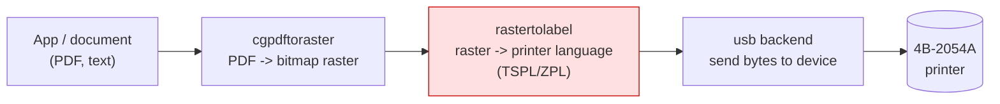
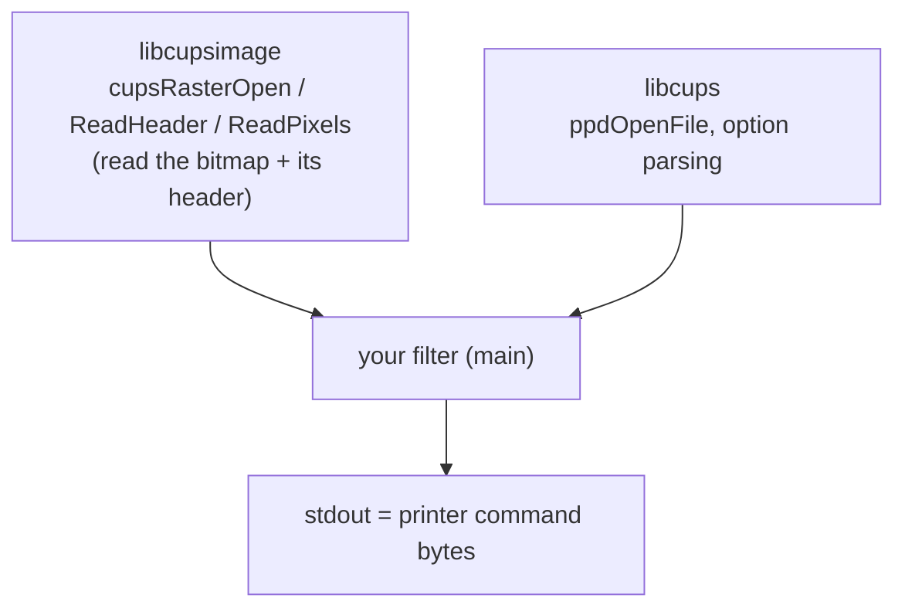
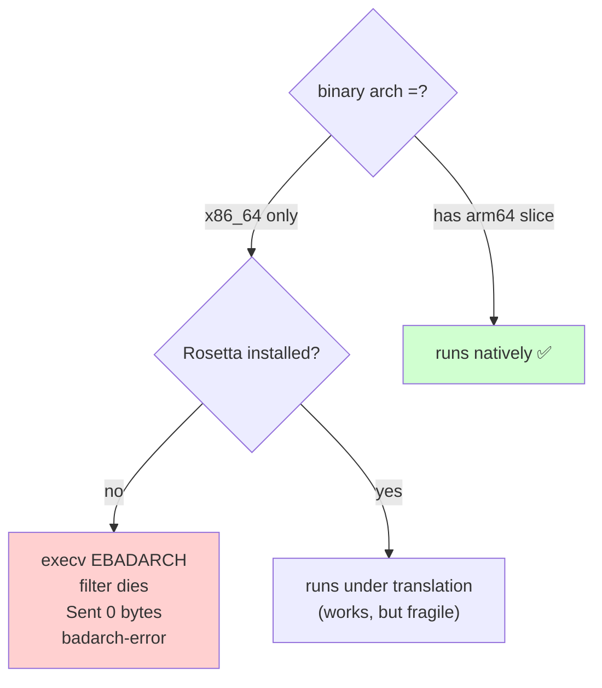
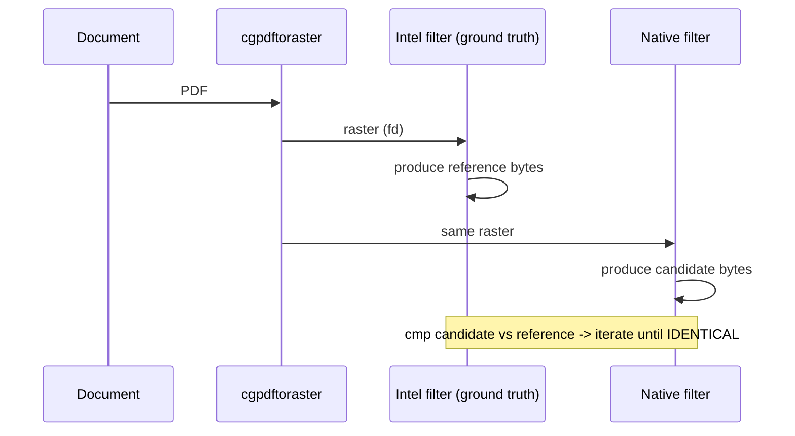
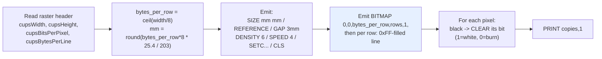
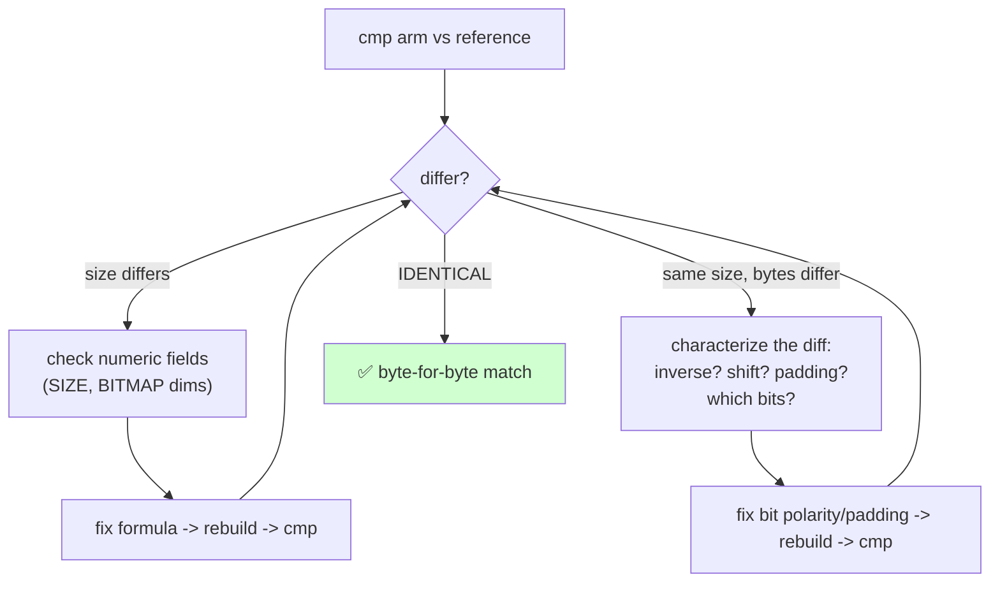
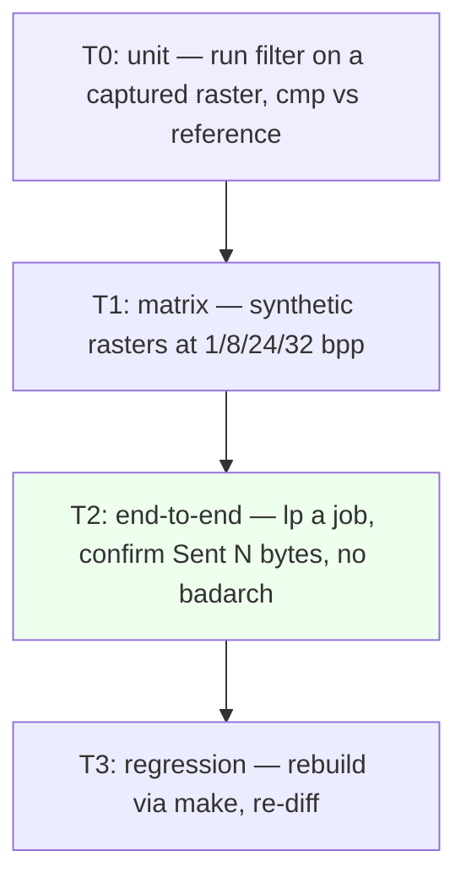
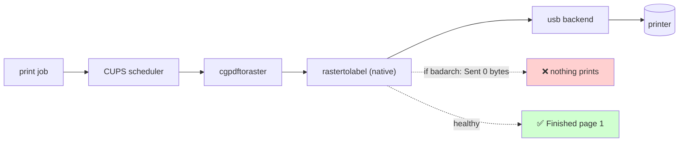

# Bringing a Dead Thermal Label Printer Back to Life on Apple Silicon

### A debugging + reverse-engineering journal: making an Intel-only macOS printer driver native arm64

*Project: ZiJiang / 4BARCODE 4B-2054A "LABEL" printer on a Mac (Apple Silicon, macOS 27, arm64).*

---

## TL;DR

A USB thermal label printer stopped printing on an Apple-Silicon Mac. Root cause was a
**one-line-of-assembly problem in disguise**: the vendor's CUPS filter binary was compiled
**x86_64-only**, and **Rosetta 2** was absent, so the OS refused to launch it and CUPS jammed
the job at `com.apple.badarch-error` with `Sent 0 bytes`.

We (1) reproduced it from the CUPS debug log, (2) proved the mechanism, (3) confirmed a quick
mitigation (install Rosetta), then (4) **reverse-engineered the filter's output protocol
(TSPL2) byte-for-byte** and (5) built a **native arm64 drop-in replacement** that produces
**identical bytes** to the original — removing the Rosetta dependency entirely.

This article walks through the printer pipeline, the debugging method, the reverse-engineering
technique, the two subtle bugs we hit, and how every claim was tested.

---

## 1. The symptoms

A printer that used to work suddenly prints nothing. From the command line it *looks* fine:

```
$ lpstat -l -p _4BARCODE_4B_2054A
printer _4BARCODE_4B_2054A is idle.  enabled since ...
	Sending data to printer.          <-- stuck message
	Description: LABEL
	Alerts: com.apple.badarch-error   <-- the real signal
```

A job sits in the queue forever, "Sending data to printer", never completing, never printing.

The machine (a Mac mini) is **arm64**:

```
$ uname -m
arm64
```

---

## 2. Background: how a printer actually works

A label printer is a tiny embedded computer that receives a **command stream** over a link
(USB, Ethernet, Serial, Bluetooth, Wi-Fi) and drives a thermal printhead. It does **not**
receive pixels like an image; it receives instructions in a **page description / printer
control language**.

Two families dominate label printing:

| Language | Example vendors | Typical commands |
|---|---|---|
| **ZPL / ZPL II** | Zebra | `^XA … ^FO … ^XGI … ^XZ` |
| **TSPL / TSPL2** | TSC (and OEMs like ZiJiang) | `SIZE … BITMAP … PRINT` |
| EPL / Eltron | (legacy) | `N … A … P …` |
| CPCL | Sato/Intermec | `! … TEXT … PRINT` |

Your app (label software, a browser, BarTender, a shop platform) produces a **PDF or vector
document**. Something must translate that document into the printer's language. On macOS that
"something" is **CUPS** and its **filters**.

### 2.1 The CUPS pipeline

CUPS turns your document into printer bytes through a chain of small programs called
**filters**. The output of one filter is the input (stdin or a file) of the next.



* **cgpdftoraster** renders the PDF to a **raster bitmap** (dots at the printer's native
  resolution, 203 dpi = 8 dots/mm here). Apple ships this; it's universal (arm64e).
* **rastertolabel** is the **vendor filter**. It packs the bitmap into the printer's command
  language. **This is the binary that was Intel-only.**
* **usb backend** writes the final byte stream to the USB device.

### 2.2 What a "driver" is here

On macOS a "printer driver" is mostly a **PPD file** (PostScript Printer Description) plus one
or more **filters**. The PPD is a configuration manifest; the key line tells CUPS which filter
to run:

```
*cupsFilter: "application/vnd.cups-raster 0 /Library/Printers/LABEL/Filter/rastertolabel"
```

So the driver's brain is that `rastertolabel` executable. If it can't run, nothing prints.

### 2.3 The CUPS filter ABI (how a filter is invoked)

Every filter obeys the same calling convention:

```
filter  job-id  user  title  copies  options  [input-file]
```

* `options` is a space-separated `key=value` string (page size, media, …).
* If no input file is given, the previous filter's output arrives on **stdin (fd 0)**.
* The active **PPD path is passed via the `PPD` environment variable**.
* Output goes to **stdout**, which the next filter reads.

Filters usually link two libraries:



---

## 3. Diagnosis: finding the fail path

The mantra we followed: **reproduce → trace the fail path → falsify the hypothesis →
cross-reference every breadcrumb.**

### 3.1 Reproduce with the debug log

CUPS logs exactly what it runs when you turn on debug logging. The smoking gun:

```
[Job 533] Started filter /Library/Printers/LABEL/Filter/rastertolabel (PID 3346)
[Job 533] execv of /Library/Printers/LABEL/Filter/rastertolabel failed. err:86, Bad CPU type in executable
[Job 533] PID 3346 (.../rastertolabel) stopped with status 186 (Bad CPU type in executable)
[Job 533] Sent 0 bytes...
[Job 533] printer-state-reasons=com.apple.badarch-error
```

`err:86` is **EBADARCH** — the OS refused to execute the binary. `Sent 0 bytes` is the
consequence: with the filter dead, no raster ever becomes printer commands.

### 3.2 Trace & confirm the mechanism (falsification)

We didn't guess. We proved the architecture of the two candidate binaries:

```
$ file /Library/Printers/LABEL/Filter/rastertolabel
Mach-O 64-bit executable x86_64                 <-- Intel only!

$ lipo -archs /Library/Printers/LABEL/Filter/rastertolabel
x86_64

$ arch -x86_64 /usr/bin/true   ;  pkgutil --pkg-info com.apple.pkg.RosettaUpdateAuto
bad CPU type in executable      (no receipt)     <-- Rosetta NOT installed
```

The hypothesis **"the filter is x86_64-only and Rosetta is missing"** explains every
breadcrumb: `Bad CPU type`, `status 186`, `Sent 0 bytes`, `badarch-error`.



### 3.3 Mitigation first (cheap, reversible)

Installing Rosetta made it print immediately, proving the diagnosis end-to-end:

```
$ softwareupdate --install-rosetta --agree-to-license
$ # print a job:
[Job 536] Started filter .../rastertolabel
[Job 536] .../rastertolabel exited with no errors.
[Job 536] Sent 79970 bytes...
printer-state-message="Finished page 1."
```

But Rosetta is a **translation crutch**: it can be removed by a future OS event, costs disk,
and would break again on a clean install. So we set out to build the **real** fix: a native
driver.

---

## 4. Reverse-engineering the original filter

To replace `rastertolabel`, we had to know **exactly** what bytes it emits. There was no source,
only the DMG package and a compiled binary.

### 4.1 Unpack the vendor package

The shipped driver is a `.pkg`. We expanded it and extracted the payload:

```
LABEL.dmg -> LABEL_v1.0_signed.pkg (com.ZIJIANG_LABEL)
            ├── /Library/Printers/LABEL/Filter/rastertolabel   (x86_64 binary)
            ├── /Library/Printers/LABEL/PPDs/LABEL.ppd
            └── /Library/Printers/PPDs/Contents/Resources/LABEL.ppd.gz
```

The **PPD** revealed the device's model: a huge `*PageSize` table (w283h283 = 100mm×100mm, …)
and the single `*cupsFilter` line pointing at the raster filter.

### 4.2 Read the binary's mind with `strings`

Static analysis of an executable's string table often reveals the protocol and the API it
uses:

```
$ strings rastertolabel | grep -iE 'bitmap|size|gap|density|speed|print|cls'
SIZE  %d mm ,%d mm
REFERENCE 0,0
GAP 3 mm,0 mm
OFFSET 0 mm
DENSITY 6
SPEED 4
SETC AUTODOTTED ...
CLS
BITMAP 0,0,%u,%u,1,
PRINT %d,1
%zu job-id user title copies options [file]

$ nm -m rastertolabel | grep ' (undefined)'
_cupsRasterOpen  _cupsRasterReadHeader  _cupsRasterReadPixels   (libcupsimage)
_ppdOpenFile                                                     (libcups)
_getenv
```

Two conclusions:
1. The output language is **TSPL/TSPL2** (the `SIZE/GAP/BITMAP/PRINT` grammar).
2. The filter reads the raster with **`libcupsimage`** — meaning we can do the same natively
   and never hand-decode the raster format.

*(The binary also contained ZPL strings — `~DG`, `^XG` — revealing that the same filter has
multiple **emulation modes** selected by options. This printer used the TSPL mode.)*

### 4.3 The differential method (the key technique)

Rather than disassemble, we used **differential reverse engineering**: feed the **same** input
raster to the **Intel filter** (under Rosetta) and to **our new filter**, then `cmp` the two
byte streams. Any difference is a behavior we must reproduce.



The golden rule: **the original binary is the specification.** We only need our output to be
byte-identical, not our code to be elegant.

---

## 5. The raster-to-TSPL transform

This is the algorithm we reconstructed (for the production path, 8-bit grayscale raster at
203 dpi).



Key facts discovered empirically:
* **Resolution** is fixed at **203 dpi**; `mm` is computed from the **byte-padded** pixel width.
* **BITMAP polarity is inverted**: in the packed row, **`1` = white (no burn), `0` = black
  (burn)**, and padding bits beyond the true width are `1`.
* Real pipeline input is **8-bit grayscale** (`cupsBitsPerPixel=8`, confirmed from a live job log).

A label therefore begins as a mostly-white row (`0xFF 0xFF …`) with bits **cleared** where ink
should go.

---

## 6. Two subtle bugs (and how we caught them)

Both were invisible to "does it look right" and obvious only via the byte-diff.

### Bug 1 — width rounding: `SIZE` off by one millimetre
```
x86: SIZE 107 mm ,138 mm
arm: SIZE 106 mm ,138 mm      <-- width wrong
```
Cause: we computed width `mm` from the raw pixel width; the original uses the **byte-padded**
width (`bytes_per_row * 8`). Fix was one line: derive `mm` from the padded width.
`107*8*25.4/203 = 107.1 → 107`.

### Bug 2 — polarity: our bitmap was blank
After the SIZE fix, the file sizes matched but **`cmp` reported thousands of differing bytes**,
and our bitmap was mostly `0x00` while the reference was mostly `0xFF`:
```
x86 row0: 2c ff ff ff ...
arm row0: 2c 00 00 00 ...
```
Analysis showed TSPL uses **`1 = white`** and clears bits for black, plus **padding bits stay
`1`** (which is why the last byte on blank rows read `0x3F` — six white padding bits). Fix:
**start each row `0xFF`-filled and clear bits for black pixels** instead of setting them.



The "every run is a breadcrumb" discipline mattered: we tracked each `cmp` result and, when a
hypothesis (e.g. "just invert every bit") didn't explain *all* prior observations (byte0 matched
but byte1 didn't), we refined rather than guessed again.

---

## 7. Building the native driver

The filter is a ~150-line C program that: parses argv per the CUPS ABI, opens the raster with
`libcupsimage`, reads the header, emits the TSPL header lines, walks each row and packs it, then
emits `PRINT`. It reuses the *same libraries* the original did — that's why a native build is a
faithful, low-risk port.

### 7.1 A build-environment gotcha (tooling ≠ target bug)
`make` initially failed at **link** time with:
```
ld: tapi error: malformed file ... libcups.2.tbd: unknown architecture  arm64e.x1
```
This was **not** a bug in our code — it was the beta `MacOSX27.sdk` stubs listing an
`arm64e.x1` target that the linker (`ld-1267`) didn't understand. Solution: build against the
**stable SDK (MacOSX26.5.sdk)**. Real dylibs live in the dyld shared cache, so we link via
`-lcups -lcupsimage`. Lesson: a build failure isn't necessarily an algorithm failure.

### 7.2 A universal binary
We produce a **fat** binary so the same file works on Apple Silicon *and* Intel Macs:
```
$ lipo -archs rastertolabel
x86_64 arm64
```

### 7.3 Installing it safely
The installer **backs up** the original before replacing it, and keeps the same path so the
PPD still points at it:
```
/Library/Printers/LABEL/Filter/rastertolabel            (now native)
/Library/Printers/LABEL/Filter/rastertolabel.intel.orig (backup)
```

---

## 8. How we tested

Layered testing, cheapest signal first:



* **T0 — byte-diff (the core test).** Feed an identical raster to both filters, `cmp` the
  outputs. On the production 8bpp raster: **`IDENTICAL (79970 bytes)`**.
* **T1 — format matrix.** We generated synthetic rasters at 1/8/24/32 bits per pixel with a tiny
  `libcupsimage` writer to exercise every branch. Only **8bpp** is the real production path (the
  others were handled for robustness).
* **T2 — end-to-end.** Through CUPS, the queue moved from stuck `Sent 0 bytes / badarch-error`
  to `Sent 79970 bytes / Finished page 1`, job draining cleanly.
* **T3 — regression.** `make test` re-derives everything from source so a future edit that breaks
  byte-identity fails loudly.



---

## 9. What we learned (reusable mental models)

* **A "broken printer" is often a broken *software interface*, not hardware.** The device was
  enumerated and healthy; the failure was one filter refusing to launch.
* **The debug log is the truth.** `execv … Bad CPU type` and `Sent 0 bytes` diagnosed it
  instantly; speculation would have wandered.
* **Architecture mismatches hide behind generic errors** (`com.apple.badarch-error`). Always
  check `file` / `lipo -archs` against `uname -m`, and whether Rosetta is present.
* **Differential testing beats disassembly.** When you must clone a closed binary, treat it as
  the spec and iterate on `cmp` until the bytes match. It sidesteps reading assembly.
* **Binarization has sharp edges** — bit polarity (`1=white` vs `1=black`), padding bits, and
  rounding conventions are where pixel-perfect clones live or die.
* **Reproduce cheap mitigations as evidence.** Installing Rosetta both unblocked the user *and*
  confirmed the diagnosis before we built the permanent fix.
* **Distinguish tooling failures from logic failures.** The `arm64e.x1` link error was the SDK,
  not the algorithm.
* **Make the fix self-testing.** A `make test` that byte-diffs against the reference turns an
  ephemeral reverse-engineering win into a durable, regression-proofed project.

---

## 10. Appendix — concrete fingerprints

| Item | Value |
|---|---|
| Printer | 4BARCODE / ZiJiang 4B-2054A ("LABEL"), direct-thermal, **203 dpi** |
| USB VID:PID | `0x2D84:0xB468` (11652:46184) |
| macOS queue | `_4BARCODE_4B_2054A` |
| Original filter path | `/Library/Printers/LABEL/Filter/rastertolabel` (x86_64-only, 2018) |
| Failure signature | `execv … err:86 Bad CPU type`, `Sent 0 bytes`, `com.apple.badarch-error` |
| Printer language | **TSPL/TSPL2** (`SIZE/REFERENCE/GAP/DENSITY/SPEED/BITMAP/PRINT`) |
| BITMAP encoding | `1 = white`, `0 = black`, padding bits `1`; rows `0xFF`-filled, clear for ink |
| mm from pixels | `mm = round(bytes_per_row * 8 * 25.4 / 203)` |
| Filter ABI | `filter job user title copies options [file]`, PPD via `$PPD` |
| Libraries | `libcups` (`ppdOpenFile`), `libcupsimage` (`cupsRaster*`) |
| Fix | native universal (arm64 + x86_64) filter, byte-identical output |

### Sources of the reference behaviour
* Vendor package: `LABEL.dmg` → `LABEL_v1.0_signed.pkg` (filter + PPD).
* Live CUPS debug log (`/var/log/cups/error_log`) — the failure path and the 8bpp confirmation.
* The Intel filter's own output, captured as ground truth for differential testing.
* 4B-2054 family product spec / user manual — rear-panel interfaces and page-size table.
```
